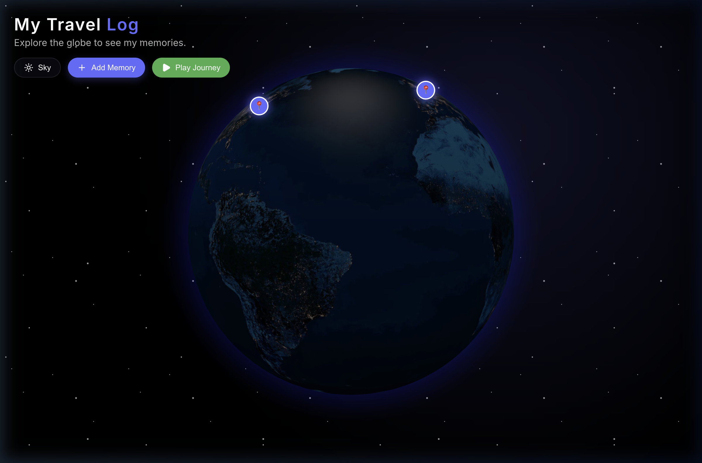
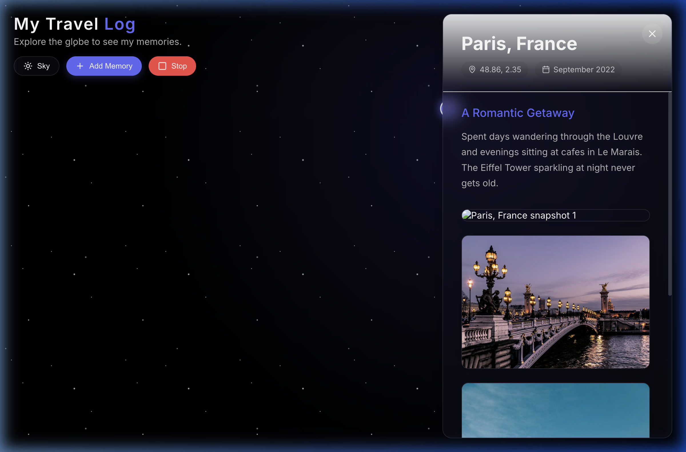
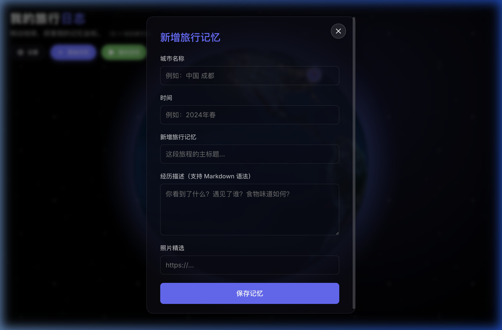

# 3D Earth Travel Log 🌍

A stunning, interactive 3D WebGL globe application built with React and Three.js to track, visualize, and present your travel memories in a highly immersive way.



## ✨ Features

- **Interactive 3D Globe**: Rendered using `react-globe.gl` and `three.js`. Supports 3D terrain displacement (mountains and valleys) and custom high-resolution textures.
- **Dual Themes**: 
  - ☀️ **Sky Mode**: Daylight earth with scrolling cloud animations and a bright, airy aesthetic.
  - 🌌 **Space Mode**: NASA Black Marble nighttime earth with glowing city lights, dynamic atmosphere, and a star-studded nebula background.
- **Memory Management (CMS)**: 
  - Add new travel logs dynamically.
  - Automatically fetches coordinates via the Nominatim OpenStreetMap API.
  - Markdown support for rich-text travelogues.
- **Time-Lapse Journey Playback**: Hit "Play Journey" to watch the camera automatically fly through your chronological travel history, drawing animated flight arcs between destinations.
- **Bilingual Support (i18n)**: Instantly switch between English and 中文 (Chinese) via the Settings panel.
- **Immersive Mode**: Hide the UI at the press of a button (`H` or `ESC`) to focus entirely on the globe. Designed with elegant frosted-glass (glassmorphism) components.

## 🔒 Admin Mode (Public Read-Only)

By default, if you deploy this project to a static host like GitHub Pages, the application boots in **Read-Only Visitor Mode**. This prevents random visitors from being confused by the "Add/Delete" buttons (since static hosts cannot permanently save user input without a backend).

**To unlock editing features (Add/Delete Memories):**
1. Open the **Settings** panel (Gear icon).
2. Click the subtle **"Admin Unlock (管理员解锁)"** button at the very bottom.
3. Enter the default passcode: `admin123`.
4. The editing UI buttons will instantly appear, and your admin status will be saved to your local browser storage.




## 🚀 Getting Started

### Prerequisites

- Node.js (v18+ recommended)
- npm or yarn

### Installation

1. Clone the repository:
   ```bash
   git clone https://github.com/yourusername/3d-earth-travel-log.git
   cd 3d-earth-travel-log
   ```

2. Install dependencies:
   ```bash
   npm install
   ```

3. Start the development server:
   ```bash
   npm run dev
   ```

4. Open your browser and navigate to `http://localhost:5173/`.

## 🛠️ Technology Stack

- **Frontend Framework**: [React 18](https://reactjs.org/) (Vite)
- **3D Rendering**: [react-globe.gl](https://globe.gl/react/) / [Three.js](https://threejs.org/)
- **Styling**: Vanilla CSS (CSS Variables, Flexbox, Glassmorphism UI)
- **Icons**: [Lucide React](https://lucide.dev/)
- **Markdown Parsing**: [react-markdown](https://github.com/remarkjs/react-markdown) + rehype-raw
- **Geocoding API**: OpenStreetMap Nominatim API (Free Forward Geocoding)

## 📁 Project Structure

```text
├── public/                 
│   └── textures/           # Local high-res Earth maps (day, night, topology, clouds)
├── src/
│   ├── components/         # React components (Earth, Settings, Forms, Detail Panels)
│   ├── contexts/           # Global Contexts (ThemeContext, LanguageContext)
│   ├── data/               # Local mock database for initial load
│   ├── locales/            # i18n translation dictionaries
│   ├── App.jsx             # Main application orchestrator
│   └── index.css           # Global theme variables and resets
└── screenshots/            # Showcase images for the README
```

## 🤝 Contributing

Contributions, issues, and feature requests are welcome! 
Feel free to check [issues page](https://github.com/CiQuBeiJiang/3d-earth-travel-journal/issues).

## 📝 License

This project is open-source and available under the [MIT License](LICENSE).
